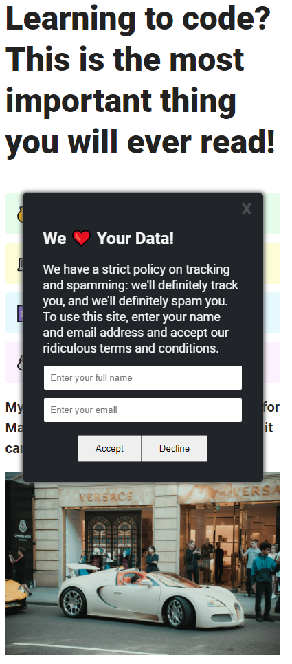

## Table of contents

- [Overview](#overview)
  - [The challenge](#the-challenge)
  - [Screenshot](#screenshot)
  - [Links](#links)
  - [How to install](#how-to-install)
- [My process](#my-process)
  - [What I learned](#wWhat-I-have-studied)

## Overview

### The challenge

Build the world's most annoying cookie consent using HTML, CSS and JS

### Screenshot

### Links

- Solution URL: [GitHub](https://github.com/memo-ibrahim-alean/Cookie-Consent)
- Live Site URL: [Live](https://memo-ibrahim-alean.github.io/Cookie-Consent/)

### How to install

- Clone Repo or Download Zip
- That's it! 🎉

### My process

What I learned

- setTimeout
- element.style
- forms
- formData & .get()
- event.preventDefault()
- CSS: row-reverse
- toggling Classes
- 'disabled' attribute
